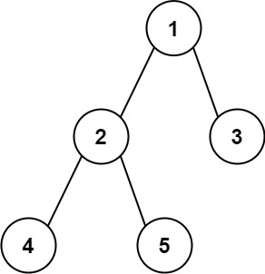

## Задача 1. Аутентификация.

### Что нужно сделать.

Сконфигурируйте логгер программы из темы 4 так, чтобы он:

- писал логи в файл stderr.txt;
- не писал дату, но писал время в формате HH:MM:SS, где HH — часы, MM — минуты, SS — секунды с ведущими нулями. Например, 16:00:09;
- выводил логи уровня INFO и выше.

### Советы и рекомендации.
[Уровни логов.](https://docs.python.org/3/library/logging.html#logging-levels)

[Аттрибуты форматирования](https://docs.python.org/3/library/logging.html#logrecord-attributes)


### Что оценивается.
- Логи записываются в файл stderr.txt.
- Время отображается с ведущими нулями.


## Задача 2. Сложность пароля.

### Что нужно сделать.
К нам пришли сотрудники отдела безопасности и сказали, что, согласно новым стандартам безопасности, 
хорошим паролем считается такой пароль, который не содержит в себе слов английского языка, 
так что нужно доработать программу из предыдущей задачи.

Напишите функцию `is_strong_password`, которая принимает на вход пароль в виде строки, 
а возвращает булево значение, которое показывает, является ли пароль хорошим по новым стандартам безопасности.

### Советы и рекомендации.
- Список слов английского языка вы можете найти в файле `/usr/share/dict/words`.  Берите слова длиной больше четырёх символов. 
- Скачайте [файл](https://gist.githubusercontent.com/wchargin/8927565/raw/d9783627c731268fb2935a731a618aa8e95cf465/words), если у вас его нет.
- Учтите, что функция может запускаться несколько раз, поэтому стоит сделать предобработку списка слов.
- Подумайте, какая структура данных лучше всего подойдёт для того, чтобы быстро узнать, есть ли конкретное слово в списке слов из файла.
- Для извлечения всех слов из пароля воспользуйтесь регулярными выражениями.

### Что оценивается.
- Игнорируется регистр слов: `PaSsWoRd` эквивалентно `password`.
- Проверка на вхождение слова в файле работает не более чем за `O(logN)`, где `N` — список слов английского языка. О том, что такое «O большое», можно почитать в материалах [Big O](https://habr.com/ru/post/444594/) и [«Сложность алгоритмов. Big O. Основы»](https://bimlibik.github.io/posts/complexity-of-algorithms/).


## Задача 3. JSON-логирование.
### Что нужно сделать.
Удобно сохранять логи в определённом формате, чтобы затем их можно было фильтровать и анализировать. 
Сконфигурируйте логгер так, чтобы он писал логи в файл `skillbox_json_messages.log` в следующем формате:

```json
{"time": "<время>", "level": "<уровень лога>", "message": "<сообщение>"}
```

Но есть проблема: если в message передать двойную кавычку, то лог перестанет быть валидной `JSON`-строкой:
```json
{"time": "21:54:15", "level": "INFO", "message": """}
```
Чтобы этого избежать, потребуется `LoggerAdapter`. 
Это класс из модуля `logging`, который позволяет модифицировать логи перед тем, как они выводятся.

У него есть единственный метод — `process`, который изменяет сообщение или именованные аргументы, переданные на вход.

```python
class JsonAdapter(logging.LoggerAdapter):
    def process(self, msg, kwargs):
    # меняем msg
    return msg, kwargs
```
Использовать можно так:
```python
logger = JsonAdapter(logging.getLogger(__name__))
logger.info('Сообщение')
```
Вам нужно дописать метод `process` так, чтобы в логах была всегда `JSON`-валидная строка.

### Советы и рекомендации.
- [LoggerAdapter Objects.](https://docs.python.org/3/library/logging.html#loggeradapter-objects)
- Обратите внимание: кавычки нужно экранировать, а не удалять или заменять на другие. Помимо кавычек есть и другие тонкости, например переносы строк. Чтобы всё учесть, воспользуйтесь методом `json.dumps`.

### Что оценивается.
- Лог выводится в формате `JSON`.
- Лог является валидной `JSON`-строкой.


## Задача 4. Анализируем логи.
### Что нужно сделать.
Ваш коллега, применив `JsonAdapter` из предыдущей задачи, сохранил логи работы его сайта 
за сутки в файле `skillbox_json_messages.log`. 
Помогите ему собрать следующие данные:

1. Сколько было сообщений каждого уровня за сутки.
2. В какой час было больше всего логов.
3. Сколько логов уровня CRITICAL было в период с 05:00:00 по 05:20:00.
4. Сколько сообщений содержат слово dog.
5. Какое слово чаще всего встречалось в сообщениях уровня WARNING.

### Советы и рекомендации.
- Для поверхностного анализа логов нередко используют `grep` - встроенную утилиту `Linux`. Например, с её помощью можно посчитать количество логов уровня `ERROR`:
```shell
- $ grep -c '"level": "ERROR"' skillbox_json_messages.log
3951
```
Или получить логи в период с 17:10:00 до 17:10:09:
```shell
$ grep '"time": "17:10:0' skillbox_json_messages.log
{"time": "17:10:00", "level": "DEBUG", "message": "scurvy's …"}
{"time": "17:10:06", "level": "ERROR", "message": "careless …"}
```
Попробуйте решить задачи 3 и 4 с помощью этой утилиты.
- Для группировки данных удобно использовать функцию itertools.groupby. Она может пригодиться, например, для группировки логов по часам.

### Что оценивается.
- Файл с логами считывается только один раз.
- Программа работает с десериализованным `JSON`.
- Сначала происходит фильтрация нужных логов, а только потом анализ. 
- Решение каждой подзадачи работает не более чем за `O(N)`.


## Задача 5. Измерение времени.
### Что нужно сделать.
Каждый лог содержит в себе метку времени, а значит, правильно организовав логирование, 
можно отследить, сколько времени выполняется функция.

Программа, которую вы видите в файле __measure_me.py__, по умолчанию пишет логи в `stdout`. 
Внутри неё есть функция `measure_me`, в начале и в конце которой пишется **"Enter measure_me"**  и **"Leave measure_me"** .

Сконфигурируйте логгер, запустите программу, соберите логи и посчитайте среднее время выполнения функции `measure_me`.

### Что оценивается.
- Для расчёта времени работы функции используются только данные, предоставленные логами.
- В логах используются не только секунды, но и миллисекунды.


## Задача 6. Список доступных страниц.
### Что нужно сделать.
Заменим сообщение `"The requested URL was not found on the server"` на что-то более информативное. 
Например, выведем список всех доступных страниц с возможностью перехода по ним.

Создайте `Flask Error Handler`, который при отсутствии запрашиваемой страницы будет выводить 
список всех доступных страниц на сайте с возможностью перехода на них.

### Советы и рекомендации.
- `Flask.errorhandler` также принимает на вход код ошибки: `@app.errorhandler(404)`
- При увеличении сайта будет неудобно каждый раз дополнять наш список доступных страниц. Подумайте, не стоит ли написать декоратор для endpoint.
- Список всех страниц можно получить и иначе — используя переменную app.url_map. Изучите пример реализации.

### Что оценивается.
- Отображаются только те страницы, по которым можно перейти.
- Используется декорирование `endpoint’ов` или `app.url_map`, а не заранее созданный список всех страниц.
- Доступные страницы отображаются только при отсутствии запрашиваемой страницы, а не при любой другой ошибке.


## Задача 7. Бинарное дерево логов.
### Что нужно сделать.
В программе реализована структура `BinaryTreeNode`, а также функция `walk_tree`, 
которая обходит бинарное дерево по уровням, при этом записывая в логи номер посещаемого 
узла и номера его потомков.

Напишите функцию `restore_tree`, которая принимает на вход путь до файла с логами 
в виде строки, а возвращает корень восстановленного бинарного дерева.

Гарантируется, что все значения, хранящиеся в бинарном дереве, уникальны.

***Пример построения бинарного дерева***



```python
root = BinaryTreeNode(1)
root.left = node2 = BinaryTreeNode(2)
root.right = BinaryTreeNode(3)
node2.left = BinaryTreeNode(4)
node2.right = BinaryTreeNode(5)
```

### Советы и рекомендации.
- Создайте словарь `{node_value: node_object}`. Это позволит быстро получить нужный узел по его значению.
- Существует [два основных алгоритма обхода графа](https://habr.com/ru/post/504374/): поиск в глубину `(Depth-First Search, DFS)` и поиск в ширину `(Breadth-First Search, BFS)`.

### Что оценивается.
- Функция `restore_tree` возвращает корень бинарного дерева в виде объекта `BinaryTreeNode`.
- Все узлы дерева из логов обходятся только один раз.


## Задача 8. Т9.
### Что нужно сделать.
У нас есть кнопочный телефон (например, знаменитая `Nokia 3310`), и мы хотим, чтобы 
пользователь мог проще отправлять СМС. 
Реализуем своего собственного клавиатурного помощника.

Каждой цифре телефона соответствует набор букв:

```text
2 — a, b, c;
3 — d, e, f;
4 — g, h, i;
5 — j, k, l;
6 — m, n, o;
7 — p, q, r, s;
8 — t, u, v;
9 — w, x, y, z.
```
Пользователь нажимает на клавиши, например `22736368`, 
после чего на экране печатается `basement`.

Напишите функцию `my_t9`, которая принимает на вход строку, состоящую из цифр 2–9, 
и возвращает список слов английского языка, которые можно получить из этой последовательности цифр.

### Советы и рекомендации.
- Список слов английского языка есть в файле /usr/share/dict/words. Посмотрите в сторону регулярных выражений.
- О Т9 и других экранных клавиатурах читайте в статье [«Эволюция экранных клавиатур»](https://droider.ru/post/evolyutsiya-ekrannyih-klaviatur-09-08-2020/).

### Что оценивается.
- Решение работает не более чем за `O(N)`. О том, что такое `«O большое»`, можно почитать в материалах [Big O](https://habr.com/ru/post/444594/) и [«Сложность алгоритмов. Big O. Основы»](https://bimlibik.github.io/posts/complexity-of-algorithms/).
- Функция возвращает список всех возможных слов, а не только первое подходящее.


## Общие советы и рекомендации.
- [Список атрибутов журналирования](https://docs.python.org/3/library/logging.html#logrecord-attributes)
- [Список директив для форматирования дат](https://docs.python.org/3/library/time.html#time.strftime)
